# LocalStack vs AWS: A Comparative Analysis of Serverless Data Ingestion

## Executive Summary

This report presents a systematic comparison of deploying a serverless data ingestion pipeline on **LocalStack** (local development) versus **AWS** (cloud production). Through 6 comprehensive experiments measuring deployment speed, pipeline performance, error handling, scalability, and IAM enforcement, I provide concrete evidence for when each environment is most appropriate.

**Key Finding**: LocalStack excels for rapid development (1.9× faster deployments, 3.2× faster total execution) while AWS is essential for validating real-world behavior, particularly event latency and realistic processing times.

---

## Architecture Overview

The system is an **event-driven serverless data pipeline** that automatically processes CSV files uploaded to S3, extracting schema information, computing statistics, detecting quality issues, and storing metadata in DynamoDB.

### Architecture Diagram

**Components**:
- **S3 Bucket**: Storage for incoming CSVs and processed results
- **Lambda Function**: Python 3.9 processor (schema inference, statistics, quality checks)
- **DynamoDB**: Metadata storage with on-demand billing

---

## Experimental Methodology

I designed 6 experiments (A, B, D, F, G, H) to measure different aspects of both environments. All experiments ran at **identical scale** on both LocalStack and AWS for fair comparison.

### Experiments Conducted

| Experiment | What It Measures | Key Metric |
|------------|------------------|------------|
| **A** | Deployment Speed | Time for `terraform apply` |
| **B** | E2E Pipeline Timing | Upload → Lambda → DynamoDB latency |
| **D** | Failure Injection | Error handling consistency |
| **F** | File Size Scaling | Processing time vs. file size |
| **G** | Parallel Scaling | Throughput with concurrent uploads |
| **H** | IAM Fidelity | Permission enforcement |

### Test Configuration
- **Test files**: 20-100 CSV files per experiment
- **File sizes**: 100 to 20,000 rows (6KB to 1.3MB)
- **Parallelism**: 1 to 100 concurrent uploads
- **Total runtime**: **220.42s (LocalStack)**, **704.55s (AWS)** → **3.2× faster on LocalStack**

---

## Results & Analysis

### 1. Deployment Speed (Experiment A)

**Finding**: LocalStack deploys infrastructure **1.9× faster** than AWS.

| Metric | LocalStack | AWS | Advantage |
|--------|------------|-----|-----------|
| Mean Time | **13.17s** | **24.81s** | **1.9× faster** |
| Median Time | 12.81s | 24.85s | 1.9× faster |
| P95 Time | 14.43s | 26.73s | 1.8× faster |
| Std Dev | 0.71s | 1.92s | More consistent |

**Visualization**:

**Insight**: LocalStack's advantage is crucial for CI/CD pipelines where fast feedback loops improve developer productivity. In a typical workday with 20 deployments, LocalStack saves **~4 minutes** per developer.

---

### 2. End-to-End Pipeline Timing (Experiment B)

**Finding**: LocalStack shows **1.5× faster** total pipeline time with significantly lower event latency.

| Stage | LocalStack | AWS | Difference |
|-------|------------|-----|------------|
| Upload Time | **0.013s** | **0.144s** | **11× faster** |
| Event Latency | **0.015s** | **0.096s** | **6.4× faster** |
| Processing Time | **1.103s** | **1.590s** | **1.4× faster** |
| **Total Pipeline** | **1.117s** | **1.686s** | **1.5× faster** |
| Success Rate | **100%** | **90%** | Better reliability |

**Visualization**:

**Critical Insights**: 
- AWS's event latency (96ms vs 15ms) represents real S3 event notification delays
- AWS had 2/20 failures (10% failure rate) vs 0% for LocalStack, showing real-world reliability issues
- For a production system processing 1000 files/hour, AWS adds ~27 seconds of event latency overhead that LocalStack doesn't reveal

---

### 3. Error Handling Consistency (Experiment D)

**Finding**: Both environments handle errors consistently (6/6 tests matched).

| Test Case | LocalStack | AWS | Match |
|-----------|------------|-----|-------|
| Empty File | error | error | ✅ |
| No Header | success | success | ✅ |
| Malformed CSV | error | error | ✅ |
| Single Column | success | success | ✅ |
| All Missing Values | success | success | ✅ |
| Oversized Row | success | success | ✅ |

**Insight**: Basic error handling can be validated in LocalStack, reducing the need for AWS testing during development. Error messages are identical between environments.

---

### 4. File Size Scaling (Experiment F)

| File Size (rows) | LocalStack Time | AWS Time | AWS Throughput |
|------------------|-----------------|----------|----------------|
| 100 | 1.027s | 1.081s | 92.5 rows/s |
| 500 | 1.037s | 2.110s | 237.0 rows/s |
| 1,000 | 1.033s | 1.071s | 933.7 rows/s |
| 5,000 | 1.035s | 2.104s | 2,376 rows/s |
| 10,000 | 1.047s | 2.096s | 4,771 rows/s |
| 20,000 | 1.030s | 2.103s | 9,511 rows/s |

**Processing Time vs File Size**:

**Critical Insight**: LocalStack provides consistent, predictable performance (~1.03s) across all file sizes, while AWS exhibits unpredictable variations (~1.08s to ~2.1s) due to cold starts and network latency. LocalStack's stability and speed make it superior for local development, enabling faster iteration without cloud infrastructure overhead.

---

### 5. Parallel Upload Scaling (Experiment G)

**Finding**: LocalStack shows **linear scaling**; AWS shows more realistic throughput with modest degradation.

| Parallelism | LocalStack Upload | AWS Upload | LocalStack Process | AWS Process |
|-------------|-------------------|------------|-------------------|-------------|
| 1 file | 85.5 files/s | 12.6 files/s | 0.20 files/s | 0.20 files/s |
| 5 files | 160.6 files/s | 20.1 files/s | 0.99 files/s | 0.97 files/s |
| 10 files | 186.3 files/s | 30.1 files/s | 1.94 files/s | 1.88 files/s |
| 20 files | 202.2 files/s | 26.3 files/s | 3.82 files/s | 3.54 files/s |
| 50 files | 324.6 files/s | 28.2 files/s | 9.48 files/s | 7.50 files/s |
| 100 files | 238.9 files/s | 64.7 files/s | 18.27 files/s | 12.10 files/s |

**Upload Throughput Scaling**:

**Processing Throughput Scaling**:

**Critical Insights**: 
- LocalStack upload throughput is erratic (peaks at 324 files/s at N=50, drops to 239 at N=100)
- AWS shows steadier throughput that peaks at N=100 (64.7 files/s), suggesting better multi-threading
- Processing throughput scales similarly in both (18.3 vs 12.1 files/s at N=100)
- Both environments handle 100 concurrent uploads successfully, but AWS is more predictable

---

### 6. IAM Policy Fidelity (Experiment H)

I successfully created an IAM role on localStack, but I couldn't create it on either aws leaner lab or aws innovation sandbox. (I had to use my own aws account.)
LocalStack does not enforce IAM or service-level restrictions. It accepts almost any IAM role creation request.

**Finding**: Basic IAM validation works in both environments (4/4 tests passed).

```mermaid
%%{init: {'theme':'base'}}%%
graph TD
    subgraph "IAM Tests - All Passed ✅"
    T1[Lambda read from uploads/]
    T2[Lambda write to processed/]
    T3[Lambda write to DynamoDB]
    T4[Environment variables]
    end
    
    T1 --> P1[✅ LocalStack ✅ AWS]
    T2 --> P2[✅ LocalStack ✅ AWS]
    T3 --> P3[✅ LocalStack ✅ AWS]
    T4 --> P4[✅ LocalStack ✅ AWS]
    
    style T1 fill:#e3f2fd
    style T2 fill:#e3f2fd
    style T3 fill:#e3f2fd
    style T4 fill:#e3f2fd
    style P1 fill:#c8e6c9
    style P2 fill:#c8e6c9
    style P3 fill:#c8e6c9
    style P4 fill:#c8e6c9
```

**Limitation**: LocalStack uses simplified IAM without full policy evaluation. Complex IAM conditions, resource-based policies, and permission boundaries require AWS validation.

---

## When to Use Each Environment

### 🚀 Use LocalStack For:

| Use Case | Why LocalStack Excels | Evidence |
|----------|----------------------|----------|
| **Feature Development** | 1.9× faster deployments | Experiment A |
| **Unit Testing** | 100% success rate, instant feedback | Experiment B |
| **CI/CD Pipelines** | 3.2× faster total execution (220s vs 705s) | All experiments |
| **Error Handling Tests** | Consistent with AWS (6/6 matches) | Experiment D |
| **Cost-Free Iteration** | $0 vs $2-5 per test suite | N/A |

### ☁️ Use AWS For:

| Use Case | Why AWS is Essential | Evidence |
|----------|---------------------|----------|
| **Production Validation** | 10% failure rate shows real issues | Experiment B (2/20 failures) |
| **Performance Benchmarking** | Reveals bimodal Lambda performance | Experiment F |
| **Capacity Planning** | Shows realistic 2.1s processing for some files | Experiment F |
| **Event Reliability Testing** | 6.4× slower event latency (96ms vs 15ms) | Experiment B |
| **Scaling Validation** | More predictable throughput curves | Experiment G |

---

## Key Takeaways

```mermaid
%%{init: {'theme':'base'}}%%
mindmap
  root((LocalStack<br/>vs<br/>AWS))
    LocalStack Strengths
      1.9× faster deploy
      3.2× faster execution
      100% success rate
      $0 cost
    AWS Strengths
      10% real failure rate
      Bimodal Lambda perf
      6.4× real event latency
      Predictable scaling
    Strategy
      LS for 90% dev work
      AWS for validation
      Complementary tools
      Hybrid approach
```

1. **LocalStack accelerates development** with 1.9× faster deployments, 3.2× faster total execution, and 100% success rates—ideal for rapid iteration.

2. **AWS reveals production realities** that LocalStack masks:
   - 10% failure rate (2/20 runs failed) vs 0% on LocalStack
   - Bimodal Lambda performance (~1.08s vs ~2.1s) indicating cold starts
   - 6.4× higher event latency (96ms vs 15ms) representing real S3 delays
   - More predictable parallel scaling behavior

3. **The environments are complementary**, not competitive. LocalStack for velocity, AWS for validation.

4. **Cost savings are significant**: Using LocalStack for development saves **$50-100/month** while maintaining 100% success rates locally.

5. **Performance assumptions differ dramatically**: LocalStack's consistent 1.03s processing (regardless of file size) would lead to under-provisioned production systems if not validated on AWS.

---

## Conclusion

This analysis demonstrates that **neither LocalStack nor AWS alone is sufficient** for modern serverless development. LocalStack's 1.9× deployment speed and 3.2× total execution speed make it indispensable for rapid iteration, while AWS's realistic behavior (10% failures, bimodal performance, 96ms event latency) is essential for production readiness.

The optimal strategy uses LocalStack for 90% of development work, reserving AWS for critical validation of reliability, performance, and production behavior—balancing development velocity with operational confidence.
